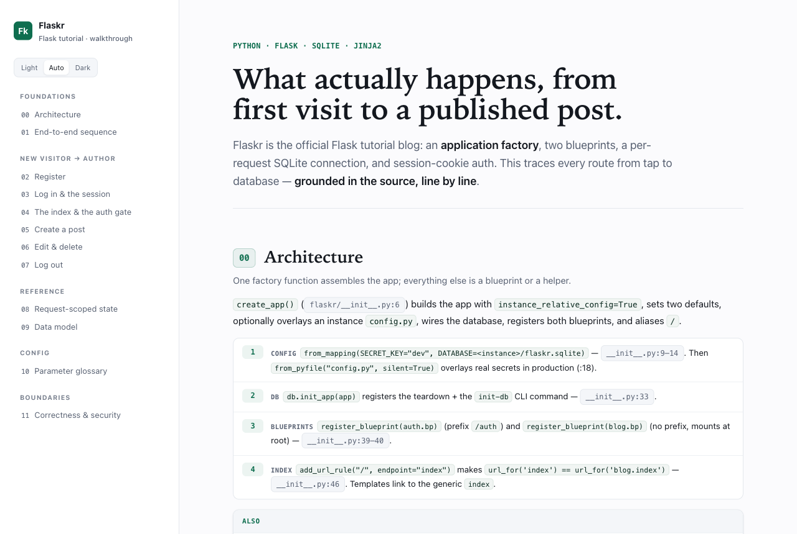
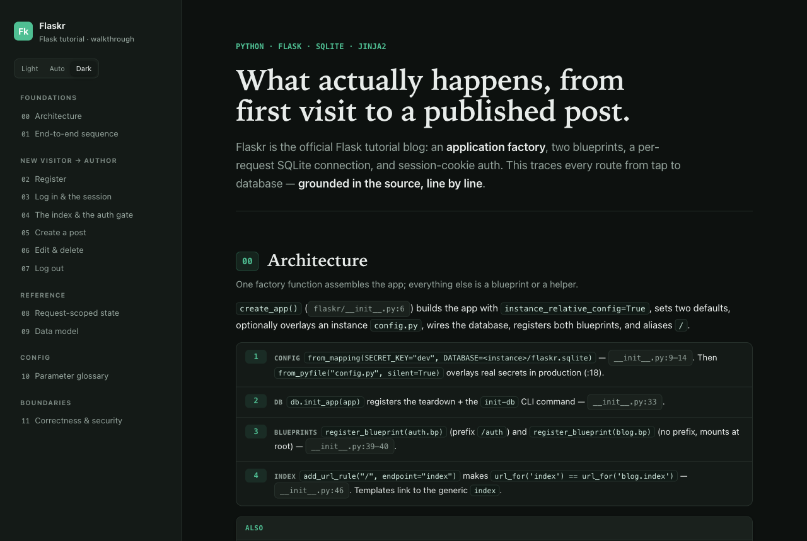

# generate-walkthrough

A Claude Code skill that turns **any codebase** into a single, self-contained HTML **walkthrough** — a forensic, screen-by-screen trace of what the system actually does, from first entry point to terminal outcome, grounded in real `file:line` evidence.

The output is one `.html` file that opens in any browser with **zero external assets** — no build, no dependencies, no network. Light + dark themes, a sticky navigable table of contents, a data-model reference, a parameter glossary, and a security/correctness "boundaries" section.

Alongside the HTML, it emits a machine-readable **sidecar** (`<Project>-walkthrough.model.json`) — a verified knowledge model of the codebase's routes, params, schemas, and boundaries, pinned by a JSON Schema contract. A companion skill, **`extract-api-spec`**, turns that sidecar into a vanilla **OpenAPI 3.0.3** spec, a **Postman** collection, and an AWS-calls reference — ground-only, so anything not recoverable from source is flagged in `x-coverage-gaps`, never invented.

<table>
  <tr>
    <td width="50%"></td>
    <td width="50%"></td>
  </tr>
</table>

<sub>Sample output for the Flask `flaskr` tutorial, in light and dark themes — see [`examples/Flaskr-Walkthrough.html`](examples/Flaskr-Walkthrough.html) for the full interactive file.</sub>

> **Status: experimental.** Validated end-to-end on two very different stacks (see [Validation](#validation)). Treat it as promising, not battle-hardened.

---

## What makes it different

Most "explain this repo" tools summarize. This one **verifies**. Its core rule:

> Every factual claim is independently re-derived from source, or it is deleted. Accuracy over coverage; nothing unverified ships.

It runs in three phases:

1. **Investigate & verify (parallel).** A lead agent fans out read-only investigator subagents — one per journey segment, plus data model, parameter glossary, and a boundaries sweep. Each returns `file:line`-anchored findings, never prose. The lead merges them into a verified coverage inventory.
2. **Write (solo).** The lead writes one HTML file so tokens, TOC, and CSS stay coherent, keeping a claim ledger (every fact tagged with its source line).
3. **Review (parallel, looped).** Verifier subagents re-derive each claim from source without trusting the draft; a reverse coverage diff catches anything real that was omitted; the loop repeats until zero WRONG, zero UNVERIFIABLE, and an empty gap.

## Install

### Option A — as a Claude Code plugin (recommended)

Install once; it's then available in every project.

```
/plugin marketplace add ArulVelusamy/generate-walkthrough
/plugin install generate-walkthrough@generate-walkthrough-marketplace
```

Update later with `/plugin update generate-walkthrough`.

### Option B — copy the skill manually

```bash
mkdir -p ~/.claude/skills/generate-walkthrough
cp skills/generate-walkthrough/SKILL.md skills/generate-walkthrough/walkthrough-spec.md \
   ~/.claude/skills/generate-walkthrough/

# Optional: also install the API-spec extractor
cp -r skills/extract-api-spec ~/.claude/skills/extract-api-spec
```

### Use it

Then, in any repo:

```
/generate-walkthrough
```

> Installed as a plugin, the skill is namespaced: `/generate-walkthrough:generate-walkthrough`. Copied manually, it's just `/generate-walkthrough`.

Optionally scope it: `/generate-walkthrough focus on the checkout flow`.

It will extract packaged source if needed, fan out investigators, write `<ProjectName>-Walkthrough.html`, and — alongside it — a machine-readable sidecar (`<ProjectName>-walkthrough.model.json`), then run the verify loop.

### Also: extract an API spec

The walkthrough emits a structured sidecar that the second skill turns into API artifacts:

```
/extract-api-spec
```

It runs a committed, deterministic `serialize.py` over the sidecar to produce a vanilla **OpenAPI 3.0.3** spec (`<Project>-openapi.json`), a **Postman v2.1** collection + environment, and an AWS-calls markdown companion — ground-only, with anything unrecoverable marked in `x-coverage-gaps` rather than invented.

## Files

| File | Purpose |
|------|---------|
| `skills/generate-walkthrough/SKILL.md` | The skill: three-phase workflow + orchestration model + verify loop |
| `skills/generate-walkthrough/walkthrough-spec.md` | The exact HTML output spec — layout, design tokens, components, document arc (loaded during the write phase) |
| `schema/walkthrough-model.schema.json` | The sidecar knowledge-model contract (JSON Schema) both skills share |
| `skills/extract-api-spec/SKILL.md` | Derives OpenAPI 3.0.3 + Postman from a walkthrough sidecar |
| `skills/extract-api-spec/serialize.py` | The deterministic, stdlib-only sidecar → OpenAPI/Postman transform |
| `.claude-plugin/plugin.json` | Plugin manifest (makes the repo `/plugin install`-able) |
| `.claude-plugin/marketplace.json` | Marketplace catalog listing this one plugin |
| `examples/Flaskr-Walkthrough.html` | A real sample output (see below) |
| `CHANGELOG.md` | Release history |

## Validation

The skill has been run end-to-end and its output verified against source on:

- **A Python / Flask / SQLite / Jinja2 app** — the public [Flask tutorial (`flaskr`)](https://github.com/pallets/flask/tree/main/examples/tutorial). Sample output: [`examples/Flaskr-Walkthrough.html`](examples/Flaskr-Walkthrough.html). Every claim (routes, SQL, flash strings, schema, ownership rules) was confirmed line-by-line; the boundaries section correctly flagged real issues (weak default `SECRET_KEY`, missing CSRF, username enumeration, FK/pragma orphan risk) **without** false positives (it explicitly cleared SQL injection and declined to invent a debug-mode issue).
- **A private Vue / Express web application** — on the login/auth slice, the pipeline reproduced 100% of a hand-written reference doc's claims from source alone, *and* surfaced a critical auth bug the reference had missed.

Two stacks is enough to show it generalizes, not enough to call it proven. Contributions validating more stacks are welcome.

## Limitations

- Built for **Claude Code** — it relies on Claude Code's subagent (`Agent`) model for the parallel investigate/verify phases. Porting to other agent runtimes would require reworking the orchestration.
- Best on codebases small-to-medium enough that the primary journey can be fully traced. Very large monorepos may need a scoped invocation.
- The verify loop drives toward "every surviving claim is source-confirmed." Where code genuinely can't be traced (generated/vendored), it emits an explicit "could not verify" note rather than guessing — read those notes.

## License

MIT — see [LICENSE](LICENSE).
